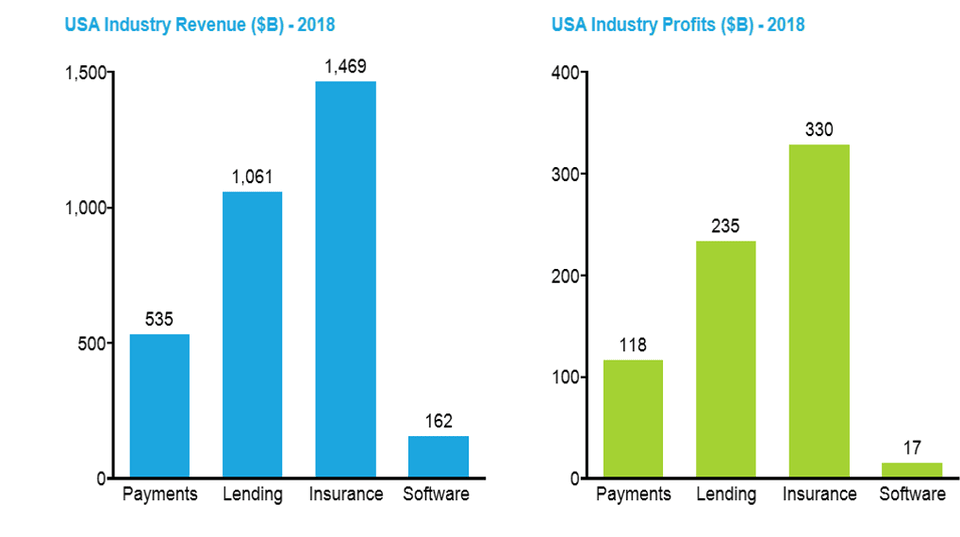

Hello and welcome to E-conomy, a weekly newsletter on the economy of bits. Today, I’m introducing a new segment called 3 Reads. 3 Reads will detail the three most important pieces that led to the development of my thinking in writing my last essay, and explore how those pieces relate to the essay’s original hypothesis. 3 Reads are written to be stand-alone posts: you don’t have to first read the accompanying essay for them to make sense, though it will deepen your understanding of what I’m talking about.

Last week I published Marc Andreessen's Original Sin, an exploration of why the failure to build money into the core of the internet was so impactful. I really appreciate everyone who read and shared the post, as well as those who sent me their thoughts and critiques. Without further ado, let’s get to the links!

### 1. To Better Understand the Past and Future of Money on the Internet, Listen To:

[a16z Podcast: From the Internet’s Past to the Future of Crypto](https://a16z.com/2019/08/29/internet-past-crypto-future-crypto-regulatory-summit/) with Marc Andreessen and Katie Haun

This a16z podcast features the interview with Marc Andreessen that sparked my initial interest in the idea of native internet money. In the podcast, Andreessen chronicles the history of the early internet, from his involvement in the Mosaic browser, to the founding of Netscape, to Netscape’s struggle and ultimate failure to build native payments into the browser.

As a major internet nerd, I am fascinated by the idea of fundamentally rethinking what the internet could have been. How would the web have been different if the internet had native money? What were the turning points that sunk that vision? And where does it all go from here? There is no better answerer of those questions than Andreessen who not only shepherded the early development of the internet as CEO of Netscape, but has gone on to fund some of the most significant internet startups as general partner at a16z.

In addition to exploring the past, Andreessen outlines his case for why crypto is the future of money on the internet. It is a compelling discussion, centering on the parallels between the early internet and where crypto is today. However, I think the best parts of this podcast are the facts and stories Andreessen tells along the way. For example, did you know that it was federally illegal to do any commercial activity on the internet until 1993? Or that while building their browser, Netscape ran afoul of ITAR, the US regulations that prohibit export of weapons to foreign countries?

### 2. To Better Understand the Mechanics of Technological Disruption, Read:

[Laws of Tech: Commoditize Your Complement](https://www.gwern.net/Complement) by gwern

This is required reading for anyone who wants to understand how technology changes industries. The basic idea is that companies want to introduce as much competition as possible to markets complimentary to their own product, driving down the prices in those markets. For example, if you were selling hotdogs, you would want to drive down the price of ketchup and mustard. When the price of complementary products decreases, demand for the original product increases, allowing the company that owns that product to capture more value.

How does this relate to the idea of native internet money? Recall my description of how the internet lowers economic friction,

> [The internet lowers friction] first by eliminating distribution costs: it has become so cheap for computers to send and receive bits that once a piece of information is created, it can be sent to anyone who wants it for free. Next, it breaks down the barriers to entry for new suppliers: because the internet is an open protocol, anybody who wants to can build on top of it.

Another way of describing this process is that the internet commoditizes both content distribution and content itself. This allows outsized profits to flow to tech platforms for whom both distribution and content are complements (you’ll watch more videos on YouTube if it’s cheaper to view them, you’ll read more articles on Facebook if those articles are less expensive). By the same token, if money were built into the internet protocol, money and the distribution of money would become commoditized. Where exactly the value would flow if/when that happens is a billion, if not trillion, dollar question.

### 3. To Better Understand what Vertical/Embedded Finance is, Read:

Fintech: the Fourth Platform - Part One by Matthew Harris

While this post is a little on the technical/jargon-y side, I think it could prove to be one of the more prescient articles looking ahead to the next decade of tech. Harris’ core argument is that while companies have provided financial services with stand-alone products (e.g. Venmo for P2P payments, Square for credit card terminals), those services will increasingly become a platform to build business on top of:

> Financial functionality is becoming a native component of the stack (both technology stack and as a business model), which means there’s a growing opportunity for embedded fintech rather than pure fintech. In other words, we’re turning our attention to investing in companies that use financial technology as an ingredient versus a primary business model.

This shift to finance-as-platform is being facilitated by a slew of companies building digital infrastructure for the finance industry. For example, [Plaid](https://plaid.com/) allows users to link their bank accounts to mobile apps, [Finix](https://www.finixpayments.com/) allows companies to process their own payments, and [Cross River Bank](https://crossriver.com/) has built a developer friendly API around many traditional banking functions, such as lending and depositing. With this infrastructure, it is possible for powerful products to be built with financial services embedded into the customer experience and business model. Take the example of Shopify from last week’s post:

> Today Shopify is 47 Billion Dollar company that lets merchants build eCommerce websites, manage inventory, fulfill shipments, and much more — but the majority of their revenue comes from processing payments

This is what Harris means when he talks about finance becoming a platform. Because Shopify can offer payment processing to merchants, it can build a giant business that solves a plethora of other problems for those merchants, all supported and connected through the underlying financial infrastructure. It’s a kind of business that wouldn’t be possible in the closed financial world of the past.

If you squint a little, you can see the rise of finance-as-platform is an instance of the dynamic described above in _Commoditize Your Complements_. Competition at the infrastructure level is starting to commoditize financial services, shifting value to software products built on top of those services. And, as Harris demonstrates, there is quite a lot of potential value to be shifted:

Bonus: Reader Comment of the Week

This week’s top comment comes from Sam K, on the question of whether vertical/embedded finance or cryptocurrency is the future of money on the internet:

> The answer is both! Crypto eventually will be merged with the global financial system. For example, we already see stable coins by major players like https://www.coinbase.com/usdc. As these coins mature and become more established we could envision more and more transactions using them as the fundamental rails for payments. It's likely that governments will release authoritative ones like the fed issuing a USD crypto currency. This will make it truly possible to have an IETF protocol for payments since there will be decentralized primitives that are necessary for it.

> While it's tempting to look at this as crypto's main product is a decentralized system, I would go a level deeper and say really what crypto is great at is reducing transaction costs. Websites can easily accept payments. It will no longer be necessary to pay a ~3% fee for every transaction. Just like you said there's less friction.

> Moving money is the most basic operation in the financial system and the core-est primitive. Once you get to more complicated financial structures, crypto has even more potential to improve the traditional financial system. Take creating an ETF. Right now, it requires lots of lawyers and SEC filings and red tape - lots of transaction costs. If stock units were issued by corporations using a blockchain, then you could literally code up a verifiably fair ETF in 20 minutes. The savings increase as the financial instrument gets more complicated. If you try to use an ETF or a bespoke option / derivative to do something more complicated such as shorting a stock in a leveraged manner, the fees get much higher than a basically free S&P500 ETF. But, in a world where all of the fundamental financial primitives are cryptofied, there will be templates for all of these complicated financial structures and building one will be plug-and-play, cheap.

There’s a lot going on in this comment, but I didn’t want to cut any of it because I found it all so fascinating! Sam is arguing three main points:

1. Crypto will merge with the traditional financial system through stablecoins (cryptocurrencies pegged 1:1 to an underlying asset such as the US dollar)
2. Because crypto takes out the middleman in payments, transaction fees for payments will be reduced to near-zero
3. Crypto will go on to disrupt much of commercial banking by making it dramatically cheaper to creating new financial securities

There are a lot of open questions here. What are the big advantages of stablecoins over the existing fiat currencies? (after all, 92% of fiat currency in the world is already digital). How much does cutting out the 3% transaction fee payment processors currently charge really matter? How valuable would it be to easily create new securities? (arguably it’s already too easy to create opaque financial instruments).

However, while those questions are important, I think they belie the true advantage of crypto. While vertical/embedded finance has to work within the existing structure, crypto has the space to ask weird questions, to challenge universally-held truths, and ultimately to reimagine what the financial system could be. While most of crypto’s new ideas will probably fail, it feels risky to bet against crypto writ large. It would be a bet against human ingenuity, against our ability to create better systems for ourselves — and historically that bet tends to not have favorable odds.
