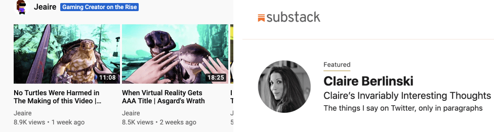

### I.

Last month, Li Jin of a16z published [The Passion Economy and the Future of Work](https://a16z.com/2019/10/08/passion-economy/). The piece centers around the emergence of the Passion Economy: the growing set of companies that allow people to “turn their passions into livelihoods, whether that’s playing video games or producing video content.” These platforms work by providing the infrastructure for creators to sell digital services/content, with the platform operator taking a cut of sales (or advertiser revenue). The article goes on to list several examples: [Substack](https://substack.com/) for newsletter writers, [Outschool](https://outschool.com/) for private tutors, [Anchor](https://anchor.fm/) for podcasters. While the focus in Jin’s article was placed on early-stage start-ups, more mature platforms like Youtube and Twitch.tv fit into this picture as well.

The Passion Economy is a classic Silicon Valley narrative in the best and worst ways. On one hand, there is a profoundly optimistic story of how new technology and business models can transform people’s lives. Through these platforms, creators can reach and monetize a huge potential audience, all with near zero start-up costs. On the other hand, the hype and capital poured into these concepts has so far raced ahead of the substance of the claims being made.

Now it’s clear that real money is being made on these platforms. Fortnite streamer [Ninja nets millions yearly](https://www.nytimes.com/2019/08/01/arts/mixer-ninja-twitch-fortnite.html) playing video games for his subscribers, while top creators on [Podia](https://www.podia.com/) earn 6 figures every month selling online educational courses. But these success stories belie a harsh reality: for every Ninja there are thousands struggling to make it. Amongst the 5000 most popular twitch streamers, the top 1% on average [collect 40% of all viewers](https://sullygnome.com/channels/viewerdistribution). While Substack’s [page of top paid newsletters](https://substack.com/) is headed by Bill Bishop’s Sinocism (thousands of subscribers each paying \$15/mo), by spot 25 you get down to publications with only hundreds of subscribers. In a review of over 19,000 YouTube channels, researcher Mathias Bärtl found that [the top 3% of channels received 85% of all views](https://journals.sagepub.com/doi/pdf/10.1177/1354856517736979).

Meanwhile, even creators who successfully enter the top percentiles often struggle to make ends meet. In Bärtl's study of YouTube channels, the average channel in the top 3% received 1.4 million views per month. While that sounds like a lot, advertisers will generally pay about [\$1 for every 1000 views](https://monetizepros.com/cpm-rate-guide/video/) on a video, implying a monthly income for top creators of \$1400 — hovering just above the [poverty line](https://www.census.gov/data/tables/time-series/demo/income-poverty/historical-poverty-thresholds.html) in the United States.

So on the largest platform for creators on the internet, the top performers get almost all of the traffic, and even then you have to be in the top percentiles of the top percentiles to make a good income. How has such extreme inequality developed? Who is killing the creator middle class?

### II.

In the early eighties, economist Sherwin Rosen, while poring over economic data across different markets, began to notice a startling trend. From stand-up comedy to elementary school textbooks, large industries were being increasingly dominated by a small number of high-earning “superstar” performers. In his seminal 1981 paper, [The Economics of Superstars](https://www.uvm.edu/pdodds/files/papers/others/1981/rosen1981a.pdf), Rosen formalized these observations, presenting a mathematical model to explain why markets were forming in this way. According to Rosen, two conditions must be met for a market to be dominated by superstars:

First, in superstar markets producers are highly differentiated — there are large benefits to consuming from higher talented individuals. As Rosen puts it:

> …hearing a succession of mediocre singers does not add up to a single outstanding performance. If a surgeon is 10 percent more successful in saving lives than his fellows, most people would be willing to pay more than a 10 percent premium for his services. A company involved in a \$30 million law suit is rash to scrimp on the legal talent it engages

However, high differentiation alone is not sufficient to create the conditions for superstars to dominate. The second, increasingly important condition is technology. Specifically, the degree to which technology allows for creators to scale themselves. The easier technology makes it for creators to distribute their work, the more rewards will accrue to the most talented who can effectively serve the entire market.

For Rosen writing in 1981 the key distribution technology was television. TV made it so Chris Rock could broadcast his comedy set to every household in America, eliminating the desire for many to go to their local comedy club. Creator platforms represent the next step in that evolution. The internet dramatically lowers friction which allows for even more people to seamlessly consume content from creators. In addition, the internet has expanded the potential services that can be provided in this scalable way, allowing superstar economics to wash over an increasing number of industries.

### III.

While the picture painted above might seem dire, clearly there is a limit to the superstar-ification of platform economies. After all, it’s not like there’s a single monopolist creator on every platform. This is because people have a natural desire for diversity: they don’t want just one kind of service, and different people have different preferences. Creator platforms are not composed of a single market, but rather many different markets each typified by a “niche” that attracts its own fans. You didn’t subscribe to this newsletter because you were shopping in the “newsletter” market, but rather the “internet economy newsletter” market. Within each niche market on a platform, superstar economics win out, with a few talented producers monopolizing most, if not all, of the value.

Just how many people end up on top of a given market? That is dependent on the degree to which technology scales producers. On YouTube a couple creators can dominate hugely popular niches because an unlimited number of people can watch their videos costlessly. A platform like [Havenly](https://havenly.com/), which allows interior decorators to work with clients to design their homes, scales their creators relatively less. Decorators on Havenly must still spend time communicating with clients and designing individualized rooms that do not scale between customers. This lack of scale leaves more room at the top of every market for creators to split profits between them.

This model has interesting implications for platforms seeking to support their middle class. For one, technology can often be a hindrance to equality. The easier platforms make it for people to access creator’s content, the fewer creators will end up at the top. Moreover, discovery features like recommendation algorithms tend to suggest the most popular content/services, rewarding those already at the top. While existing platforms may be hesitant to increase friction, they can build features to help people discover newer, up and coming creators, such as YouTube’s “Creator on the Rise” or Substack’s Featured section:

These features help galvanize the creation of new niches on the platform. This is the most important thing these companies can do to support creators: the number of people who can make a living off of a platform is directly tied to the viable niches that exist on it.

However, this approach is limited: even large platforms can only support so many niches. At the end of the day, creators are not workers and as such can not be, as Jin claims in her article, the future of work. Creators are entrepreneurs. They have to work hard to create and dominate a market with a limited runway and fierce competition; the chances of success will never be high.

And perhaps that is how these platforms should be marketing themselves: not the future of work, but the future of entrepreneurship. Internet-based platforms have substantially lowered the startup costs to being a creator while increasing the potential audience from whoever was geographically close to you to the entire world. While Chris Rock could reach all of America through TV, he had to work his way through many layers of gatekeepers before he could do so. Platforms have made it so anyone can access this technology from day one, unleashing a torrent of creativity and new markets for digital services in the process. However, those gains are not distributed equally — and that seems unlikely to change any time soon.
