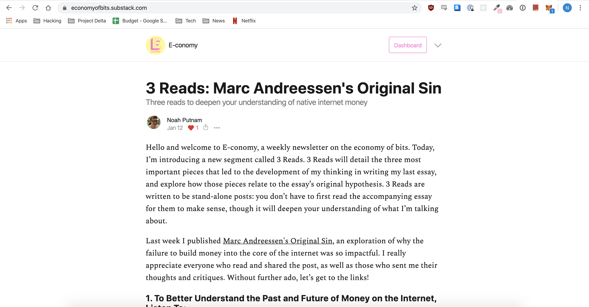
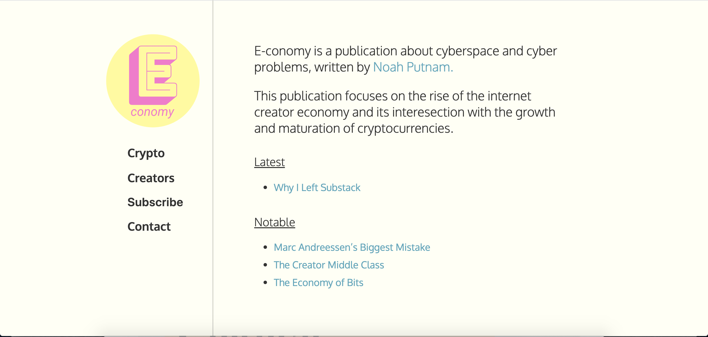

### I.

I recently made the decision to move E-conomy from Substack to a custom website I coded on GatsbyJS. Now I’m a big fan of Substack. Registering to create a new publication takes minutes, their software is intuitive and produces slick, well-designed websites, and the company has enabled hundreds of writers to find a sustainable subscription-based business model. However, I think Substack is a poor fit for most people who want to write online.

To understand why, I first want to explore the tragedy of Brasilia, mid-century Brazil’s attempt at building a utopian capital city

In 1959, the Brazilian government set out to build a capital city to enshrine the country’s newly won independence. They set aside XXXX square km in the south, by YYYY. There was no existing structure

> …it is almost as if the founders of B rasilia, rath er than having planned a city, have actually planned to prevent a city

And now the philosophy of high modernism has found its way to the web.

### II.

Brasilia was a city tailored for an aesthetic elegance that belied profound intellectual laziness on the part of its planners. Single-zoned neighborhoods, neat rectangular parks, siloed roadways — these all made Brasilia easier to design, but terrible to live in. To the extent XXX understood this, they didn’t care: Brasilia’s inhabitants would just have to adapt.

The closest analog on the web is the chronological feed. Want to know why every blog has a chronological feed? `SELECT * FROM “blog_posts” ORDER BY publish_date DESC`. That SQL query query took me 5 seconds to write, but will reliably populate a feed with content forever. Chronological feeds are information design by database management; the tail is wagging the dog.

Now chronological feeds are suitable for some forms of content, such as news. But only presenting articles chronologically is a disastrous idea for most writers. You’re signaling to readers that they should only care about your latest ideas. You’re placing pressure on every article you write to be accessible to new readers, who will assuredly start at the latest article. You’re commoditizing yourself.

</img>

Substack’s UI is an especially egregious example of this pattern. The homepage of a publication is simply the latest article published: there’s no indication there’s more to the publication beyond that.

Compare to E-conomy’s new homepage:

I can explain the thesis of the publication, give links to the different topics I explore, and call out the most notable articles I’ve published. This is a much more natural way for people to learn about new ideas. By making the effort to curate these different entrypoints

### III.

The biggest problem people had with Brasilia was not its garish architecture, or it’s sprawling, lifeless parks — it was something far more practical: Brasilia was a city that was impossible to navigate:

> The facade of each block is strictly geom etric and egalitarian. Nothing distinguishes the exterior of one apartm ent from another… Brasilia has few landm arks. Each com m ercial quarter or superquadra cluster looks roughly like any other. The sectors of the city are designated by an elaborate set of acronym s and abbreviations th at are nearly impossible to master

Scott argues that states optimize for legibility: structuring society in a way that makes it easier to map, police, and — most importantly — tax. States pursuit of legibility often places them in the conflict with the of individuals, for whom mathematical grids and uniformity are often the opposite of legibility.

Developers optimize for our own kind of legibility — not to the state, but to the server. Every component of a digital product must be specified in code such that a computer can understand it. This can often lead developers to make design decisions that make no sense to their users. Sometimes this just results in simple misunderstandings:

But other times, designing for computer legibility can have more profound consequences. Designing software with a common interface can make it easy to scale a product to thousands of users and keep it fast, but those same design decisions can make the product impossible to navigate.

This dynamic explains the modern affliction of ‘newsletter fatigue”. How many of us have had the experience of reading a great blog post, subscribing to its newsletter, only to completely forget about it? And then later on, we find our inboxes stacked full of indistinguishable newsletters, the original context totally lost.

Substack exacerbates newsletter fatigue

The problem is that, just as in the case of Brasilia, the egalitarian ideas at the core of the platform are the reason for its downfall. One-size-fits-all publications will always trend towards commoditization. The Medium is the message.

### IV.

But where does that leave us? Democratizing publishing is a truly worth goal, and not everyone has the time or desire to code up their own website. Once again, we can draw inspiration from urban design. The vibrant street corners of New York weren’t formed because all of its residents learned architecture and construction. Street corners are sedimentary structures, formed over decades of human creation and interaction.

This dynamic can exist online as well. Much of the nostalgia for the “old internet”, typified by websites like Geocities and Myspace, was for the ability for anyone to customize the structure and design of their online presence, using custom CSS. Users could even repurpose code from other people’s profiles, making it easy to build on top of others’ work. This allowed sites like Geocities to combine the scale and accessibility of a blogging platform, with the organic design of a city neighborhood.

Today Geocities is dead, along with most of the customizable Web 1.0 website builders. They’ve been replaced with Social Media and blogging platforms, whose structured data better facilitate algorithms to crawl over content and optimize for engagement. But there are a plethora of new projects attempting to push back against the monotony of high modernistic web design: glitch, tilde.club, and XXX to name a few. Maybe one of them will even succeed. For now, I’m going to keep tending to e-conomy.nyc, my own little corner of the web.
